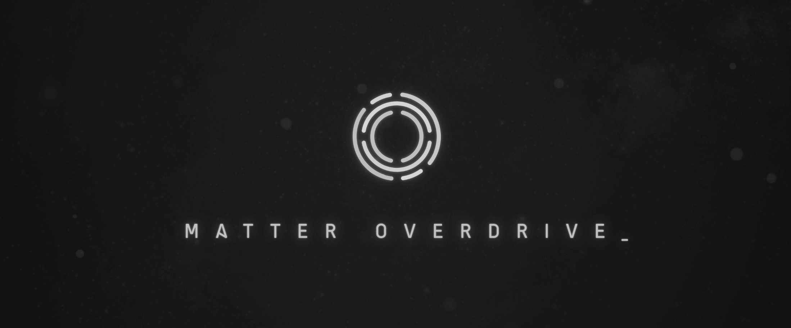

## Table of Contents
* [About](#about)
* [Features](#features)
* [Contacts](#contacts)
* [Issues](#issues)

## About
Matter Overdrive is a Minecraft mod inspired by the popular Sci-fi TV series Star Trek. It dwells in the concept of replicating and transforming one type matter into another.
Although it may seem overpowered, Matter Overdrive takes a more realistic approach and requires the player to build a complex system before even the simplest replication can be achieved.

## Contacts
* [Discord](https://discord.gg/hQyAEZV)

## Features
* [Matter Scanner](https://mo.simeonradivoev.com/items/matter_scanner/), for scanning matter patterns for replication.
* [Replicator](https://mo.simeonradivoev.com/items/replicator/), for transforming materials.
* [Decomposer](https://mo.simeonradivoev.com/items/decomposer/), for breaking down materials to basic form.
* [Transporter](https://mo.simeonradivoev.com/items/transporter/), for beaming up.
* [Phasers](https://mo.simeonradivoev.com/items/phaser/), to set on stun.
* [Fusion Reactors](https://mo.simeonradivoev.com/fusion-reactor/) and [Gravitational Anomaly](https://mo.simeonradivoev.com/items/gravitational_anomaly/), for that sweet energy.
* Complex Networking for replication control.
* Star Maps, with Galaxies, Stars, and Planets.
* [Androids](https://mo.simeonradivoev.com/android-guide/), become an Android and learn powerful RPG like abilities, such as Teleportation and Forcefields.

Mini-Changelog (from InfiniteBlock):

1. Fixed all weapon cooldown issues.
2. Fixed Villager trades.
3. Fixed Emergencyshield/Shield no more single shot kill's for Skeleton's/TechGun's
4. Fixed cloak ability ruining vision on screen.

## Issues:

https://github.com/infiniteblock/MatterOverdrive-Community-Edition/issues

Todo:

1. Allow energy transfer across matter network cables. That way connectivity and power go over one set of cables.
2. ~~Make the microwave able to "cook" food like furnaces do, getting power from RF.~~ Done. If ores are put in the microwave, make it explode.
3. Fix network flash drives to properly filter destinations.
